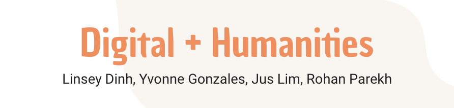

# DH101GroupProject

#### Project by Linsey Dinh, Yvonne Gonzales, Jus Lim, Rohan Parekh	
#### Course: Digital Humanities 101; Summer 2021
#### Instructors: Dr. Brooks Jessup

I am a senior at UC Berkeley researching fandom and fanfiction as literature. My focus is on parasocial relationships and how they work in fan communities, and how those manifest in fan works and catharsis. This project was completed by myself (Yvonne Gonzales), Linsey Dinh, Jus Lim, and Rohan Parekh. I wrote the introduction, thesis, and section on Tara McPherson's "Why Are the Digital Humanities So White?," Linsey wrote on Gallon's "Making a Case for the Black Digital Humanities,” Rohan worked with Grimmer's “We Are All Social Scientists Now," and Jus wrote the connections with Nan Z Da's "Digital Humanities Debacle" as well as the conclusion.

## Abstract

> The world of "digital" and the world of "human" don't often intersect, as far as the academy is concerned. That's a big problem, because in the modern world, it's simply not true. The Digital Humanities work to close the divide in the academy between what is “digital” and what is “human”, creating a new discipline that bridges and combines the two fields and methods. First, McPherson's "Why Are the Digital Humanities So White? or Thinking the Histories of Race and Computation” shows that historically, race and computation have always been interconnected. She connects the histories of early computation and civil rights ideology and proves that computers are made by people, with thoughts and flaws and ideas. Gallon's “Making a Case for the Black Digital Humanities” examines teh need for an intersectional field highlighting the "technology of recovery" and allowing Black scholars to reclaim their narratives and histories. Finally, Grimmer's “We Are All Social Scientists Now: How Big Data, Machine Learning, and Causal Inference Work Together” shows how big data is relevant and necessary in social sciences, and shows the scale at which questions can be asked with good data. All of these articles focus on how data can be used within the humanities to  look at problems in a way that remembers the human as well.

## Summary

Academia lives within departments. The English department may sometimes talk to the History department, but the History department may never speak to the people over in Statistics, or Computer Science. There’s this invisible barrier between what is “digital” and what is “humanities.” The digital and the human are not diametrically opposed, though, but rather quite interconnected. The digital could not exist without the humanities, and as the digital changes the world and how humans exist and interact, it becomes necessary to include the digital world within the study of the human world. The Digital Humanities should be an interdisciplinary field that works to close this almost fictional divide and use both humanist and digital methods to understand and research the world, in both scientific and humanist research.

In Tara McPherson’s “Why Are the Digital Humanities So White? or Thinking the Histories of Race and Computation” she goes into the interconnected histories of both computing and social justice. Her moment of comparison is the 1960s, a period where operating systems and networks were being created for the first time, right alongside the Civil Rights Movement, the Black Panthers, and the Young Lords. She then looks at the fundamental rules of good operating systems, and connects them to the changing social and political climate. Even the origins of computing are caught up in the humanist questions of identity politics and encapsulation. She shows that “computers themselves are encoders of culture” and that their uses in relationship to race, class, and gender, are just as important as their technical capabilities.

Digital humanities work on race, culture, and ethnic differences are becoming more prevalent, but still, discussion of the history behind black studies within digital humanities are almost nonexistent. Kim Gallon’s “Making a Case for the Black Digital Humanities” examines the intersectional field of the Black Digital Humanities, highlighting the “technology of recovery”: a restorative process of the stolen humanity of Black people by racism, through recovering lost historical and literary text. Though the author does not utilize the method of recovery themself, the history behind its utilization and its influence over black people’s humanity is discussed within the article, indicating the influence the digital has over humanity. Concluding the article, Gallon considers Black Digital Humanities as a means of systemic change by dissecting the way we think about humanity, and in addition, the digital humanities. 
            
As Justin Grimmer describes in his “We Are All Social Scientists Now: How Big Data, Machine Learning, and Causal Inference Work Together,” modern technology allows for the mass production and aggregation of information—a development that requires a greater intertwining of the social sciences and computer sciences. Social science is necessary to effectively analyze such large quantities of data in a way that yields useful information. Furthermore, advances in data and machine learning are a great benefit to causal inference; data allows scientists to make a much larger number of observations, and machine learning models can assist in the analysis of big data. Grimmer suggests that the increasingly overlapping fields demonstrate the need for everyone, regardless of field, to apply the social sciences.

In conclusion, Grimmer explains in their article that big data has allowed for questions to be answered at a much larger scale, yet this increase in dataset size requires social science expertise to guide interpretation. Next, in pursuing a definition of Black Digital Humanities, Gallon specifically calls for more inclusion of Black perspectives. Similarly, Tara McPherson argues that the future of Digital Humanities lies in closing the separation between it and multiculturalism and critically examining the foundations with which we store, process, and organize information. After acknowledging machine learning’s impact on social science projects, Grimmer explains that Big Data practitioners must learn from social scientists’ knowledge of robust research design in order to make correct predictions. Moreover, McPherson and Gallon both advocate for a widening perspective which provides urgency for critical thought-process reexamination and the consistent inclusion of marginalized voices. Likewise to Dr. Da’s concept of the “Digital Humanities Debacle”, McPherson and Gallon both point to cultural gaps that digital fields have yet to address, which are crucial in making relevant, significant claims in the humanities field. 
